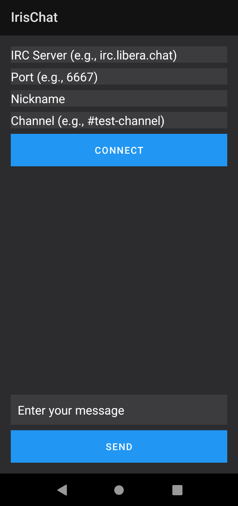

# IrisChat
## An IRC client for Android
<!-- DESCRIPTION -->
## Description:

IRC, or Internet Relay Chat, is a protocol for real-time text messaging and communication over the internet. Developed in the late 1980s, it allows users to join channels or chat rooms, where they can engage in discussions with multiple participants simultaneously. IRC operates on a client-server model, with users connecting to an IRC server using a client application. 

<!-- FEATURES -->
## Features:

- Small codebase

- Onion services support when used with [Orbot](https://orbot.app/en/)

- Built in Java

<!-- INSTALLATION -->
## Installation:

[Download](https://github.com/umutcamliyurt/IrisChat/releases)

<!-- SCREENSHOT -->
## Screenshot:

<!-- LICENSE -->
## License

Distributed under the MIT License. See `LICENSE` for more information.
