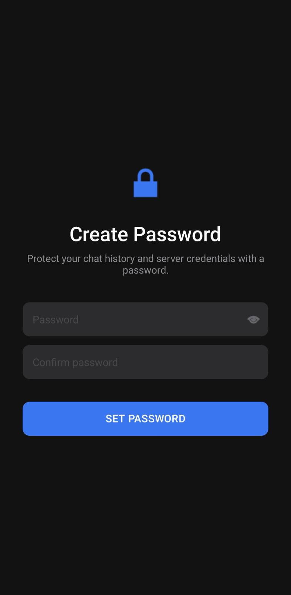
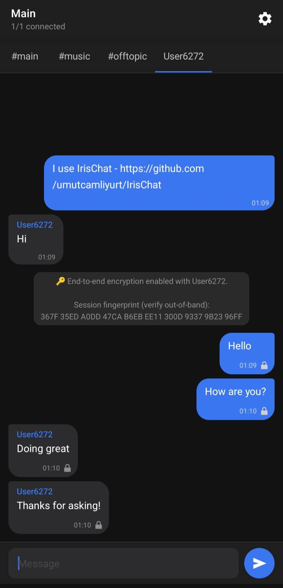
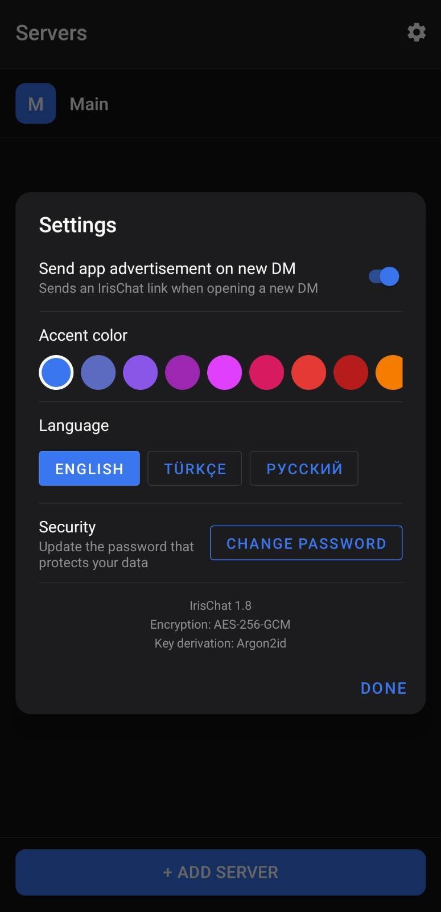

<div align="center">
<br/>

## A modern, privacy-respecting IRC client for Android


<br/>

[](LICENSE)
[](https://android.com)
[](https://openjdk.org)
[](https://en.wikipedia.org/wiki/Internet_Relay_Chat)

</div>

---

IrisChat is a lightweight, open-source IRC client for Android with a clean modern interface, local database encryption, and end-to-end encrypted DMs via the Signal Protocol.

<div style="display: flex; gap: 16px; align-items: flex-start;">



</div>

---

## Features

- Message history and credentials are encrypted locally with AES-256-GCM (PBKDF2-derived key)
- Signal Protocol with post-quantum Kyber-1024 KEM for DMs
- Elegant interface
- Easy-to-audit source code

---

## E2E Encryption

DMs between IrisChat users are encrypted end-to-end, the IRC server sees only ciphertext.

| Primitive | Detail |
|---|---|
| Key exchange | X3DH |
| Ratchet | Double Ratchet (per-message forward secrecy) |
| Post-quantum | Kyber-1024 KEM |
| Ciphers | AES-256-CBC + HMAC-SHA256 |
| Identity keys | Curve25519 |
| KDF | HKDF-SHA256 |

There is one session fingerprint per contact. If a contact's key bundle changes, the new fingerprint surfaces as a system message.

---

## Threat Model

| | Threat | Notes |
|---|---|---|
| ✅ | Passive MitM | DMs are E2E encrypted; Double Ratchet means one compromised key exposes nothing else |
| ✅ | Harvest-now-decrypt-later | Kyber-1024 KEM protects against future quantum attacks |
| ✅ | Device theft | AES-256-GCM at rest, PBKDF2-SHA256 key (310k iterations, 32-byte salt) |
| ✅ | Credential exposure | Passwords and SASL secrets never written to disk in plaintext |
| ❌ | Channel privacy | Channel messages are unencrypted (E2EE applies to DMs only) |
| ❌ | Compromised contact | Verify fingerprints out-of-band |
| ❌ | Metadata | Server always sees who talks to whom, when, and channel membership |
| ❌ | Compromised OS / root | App-layer security cannot protect against a malicious kernel |
| ❌ | Weak password | Local database encryption is only as strong as your unlock password |

---

## Installation

Download the latest APK from the [**Releases page**](https://github.com/umutcamliyurt/IrisChat/releases).

> Enable *Install from unknown sources* in Android settings if prompted.

## Building from Source

```bash
git clone https://github.com/umutcamliyurt/IrisChat.git
cd IrisChat
./gradlew assembleRelease
```

Output: `app/build/outputs/apk/release/`

---

## License

Distributed under the **MIT License**, see [`LICENSE`](LICENSE) for full terms.